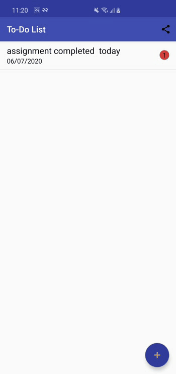

# TodoApp
This is a ToDo List App developed using Android Studio. ToDoList is software in the category of Task Management
# Features
1. User can choose the task priority (High, Medium or Low).
2. User can add new items
3. Date
4. User can update and delete existing items.
5. Added clear buttom 
6. Added Implecit Intent
# Database
 SQL-lite Database
 #Android Component
 1. Activity
 2. Intents
 3. View
 4. Sources 
 
 # GIF 

